# FitnessWay 健身會員系統

FitnessWay 是一個為健身人群打造的網站平台，依照不同角色（一般會員、團課教練、私人教練、管理員）提供相應的檢視、計算與預約功能，包括：

- 身體數據記錄圖形化  
- 團體課程預約管理  
- TDEE 計算機  
- 體驗課預及專屬教練分配  
- 私人教練課程購買流程（模擬金流）

---

## 📁 目錄結構 (File Structure)
```bash
.
├── public/                  # 圖片資料 (SVG 身型圖, 背景圖)
├── src
│   ├── app/                # Next.js App Router 目錄
│   │   ├── dashboard/      # 後台頁面分頁
│   │   │   ├── admin/         # 管理員：用戶權限、教練分配、團課管理
│   │   │   ├── group-coach/   # 團課教練：查看預約人數
│   │   │   └── personalTrainer/ # 私人教練：預約行事曆、學員列表、體驗名單
│   │   
│   │   ├── member/         # 一般會員主要頁面 (體態圖表、訓練雷達圖、預約課程顯示)
│   │   ├── group-classes/  # 預約團體課程
│   │   ├── experience/     # 預約體驗私人教練課程
│   │   ├── tdee/           # TDEE 計算機
│   │   └── login, register # 登入/註冊
│   
│   ├── components/         # UI 與模組元件
│   ├── lib/                # Firebase SDK 與登入認證
│   └── styles/             # 自製 CSS
```

---

## 🛠 使用技術 (Tech Stack)

- **Next.js 14** (App Router)
- **React 18** + **TypeScript**
- **Tailwind CSS v4**
- **Firebase** (Auth / Firestore / Storage / Admin SDK)
- **Framer Motion** / **Lucide React**
- **Recharts** / **React Calendar**

---

## 🧩 功能簡介

### `/member`

- BMI  體脂 身體數值 圖形化  
  👉 透過【身體數據紀錄表單】輸入數值，自動更新進度圖  
- 訓練雷達圖 展示訓練類型分佈    
  👉 透過【訓練紀錄表單】累積每部位的次數統計  
- 我的預約課程：顯示預約課程（團課、私人教練課預約）
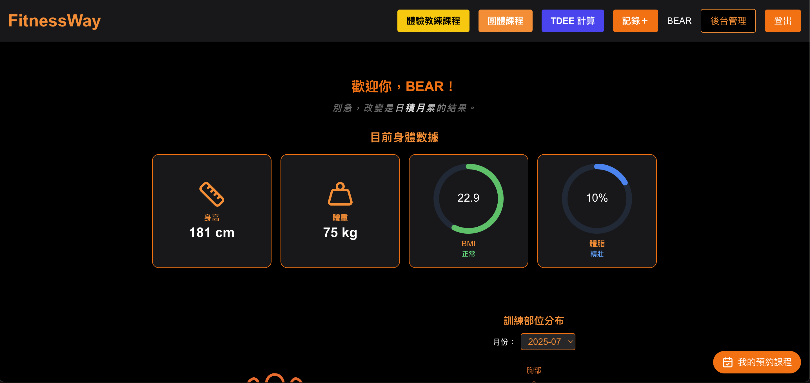

#### 📝 新增紀錄 Modal（表單輸入）

FitnessWay 提供兩種資料輸入表單，使用者每次填寫記錄後，即可同步更新圖形分析：

1. **身體數據紀錄（BMI / 體脂）**
   - 輸入身高、體重、體脂 → 進度圖立即更新
   - Firestore 儲存最新記錄
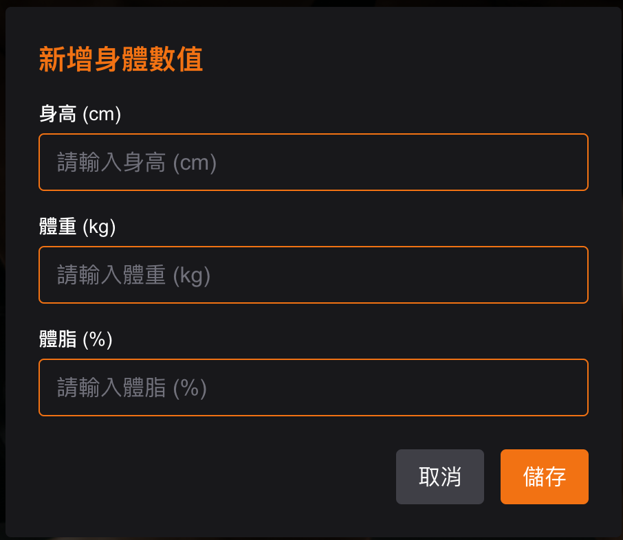
2. **訓練紀錄表單**
   - 輸入部位、動作、重量、組數、次數、日期
   - 更新雷達圖（訓練分布）與訓練日期
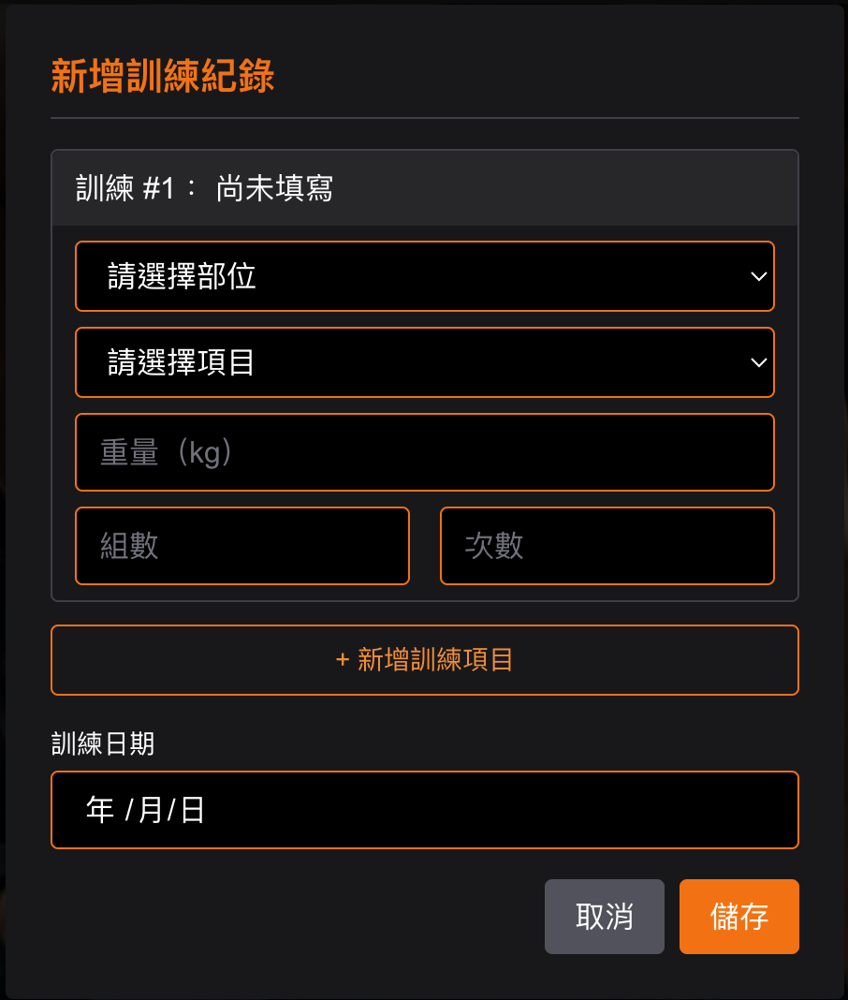

### `/group-classes`

- 團體課程表瀏覽  
- 預約 / 取消功能
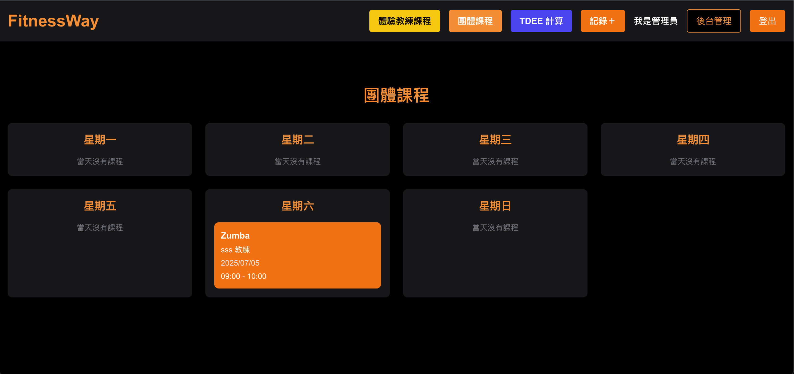

### `/experience`

- 體驗課網頁預約


### `/tdee`

- 基礎代謝 + 活動係數計算  
- TDEE 計算機
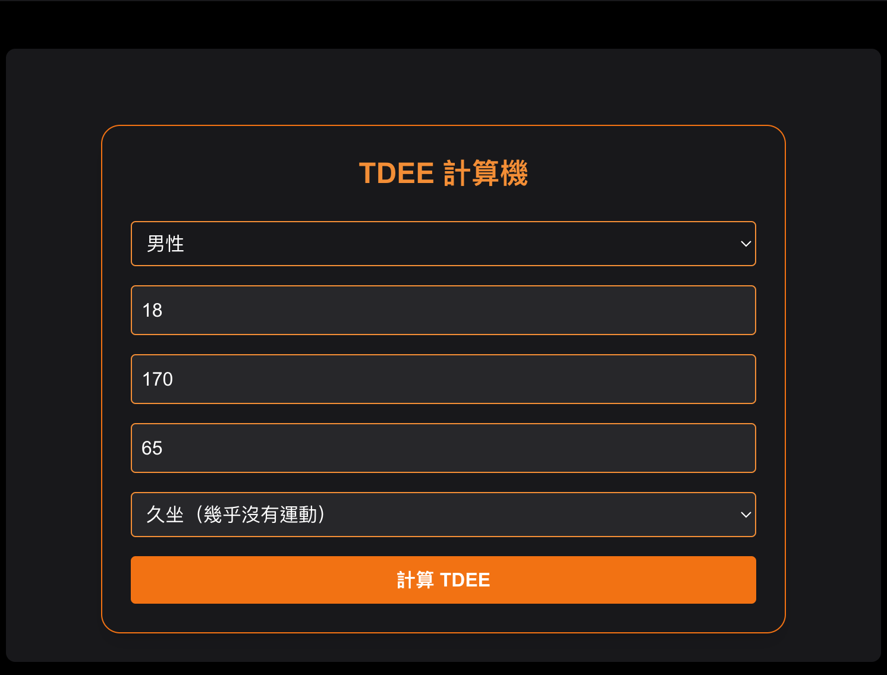

### `/dashboard`

#### Admin

- 使用者權限管理
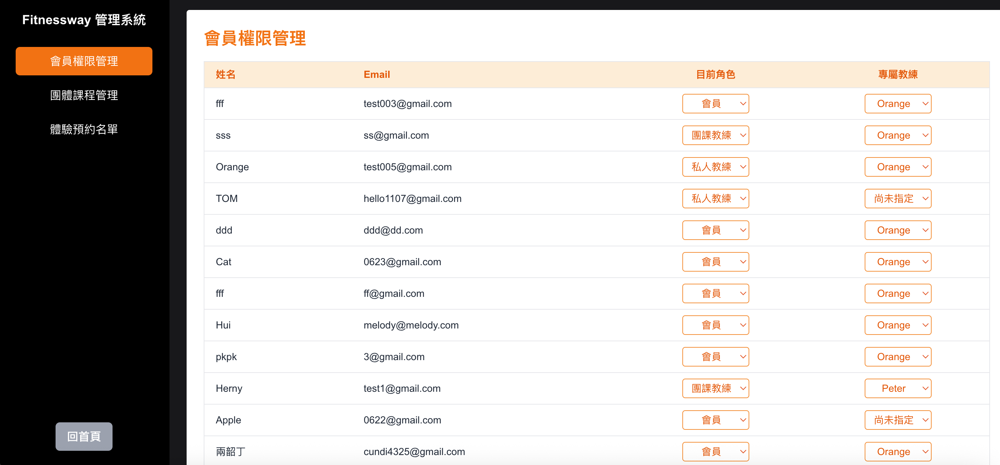 
- 團課時段新增 / 刪除
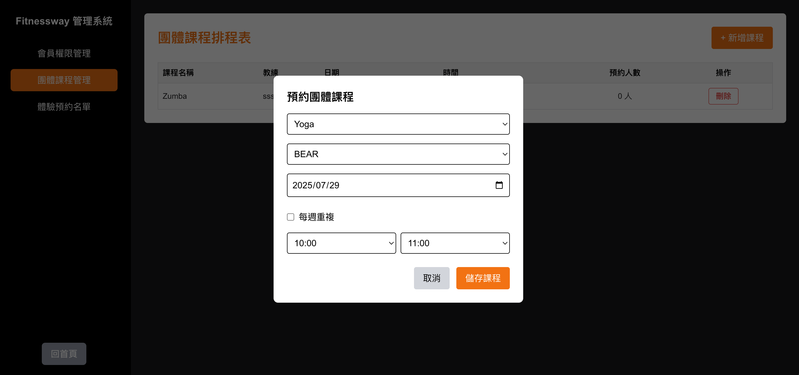
- 指派教練給體驗學員
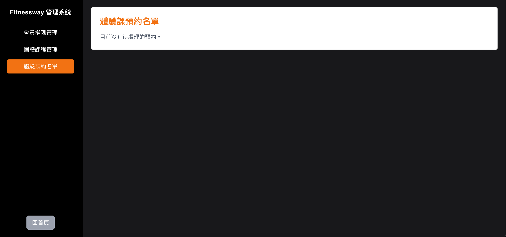

#### Group Coach

- 查看所屬課程的報名人數
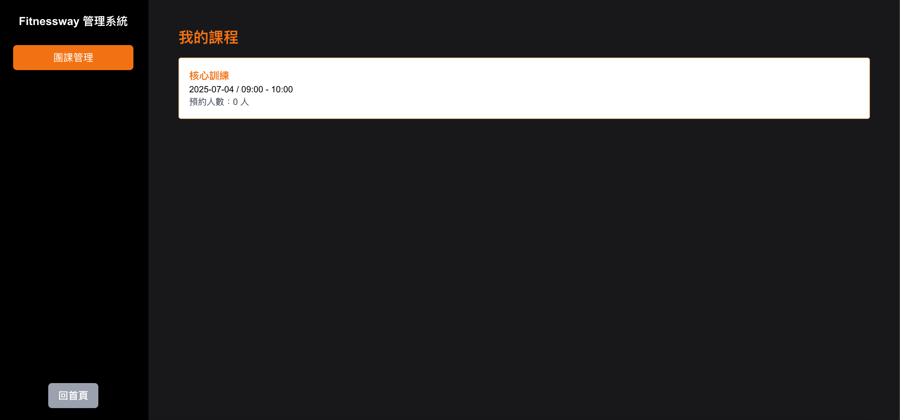

#### Personal Trainer

- 私人課排程日曆
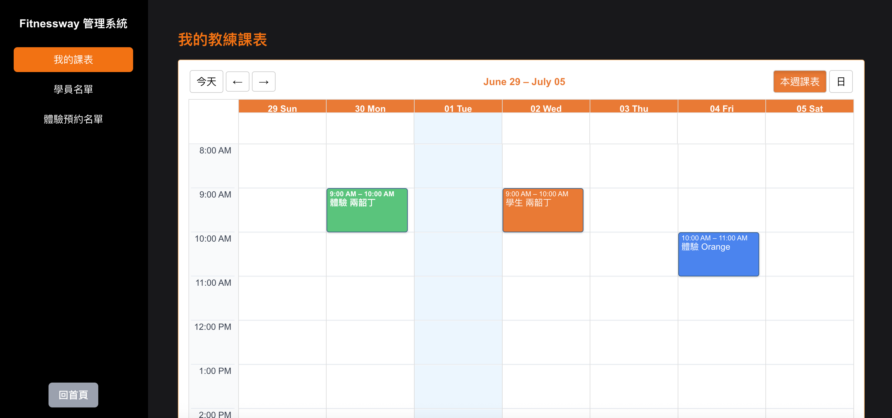
- 查看所屬學員基本資料與剩餘堂數
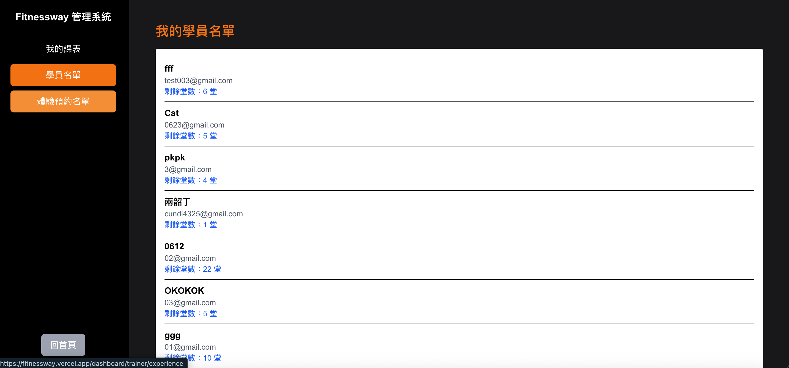
- 管理體驗課名單，模擬購買教練課程流程
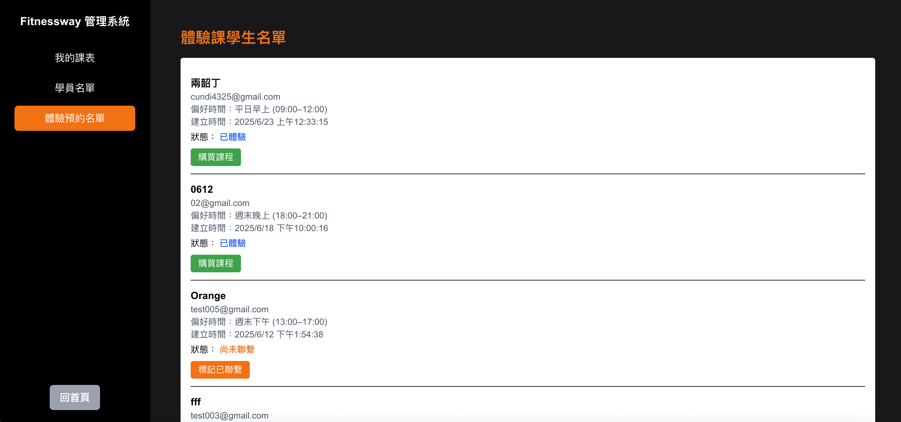


---

## 🧱 系統架構圖

下圖展示 FitnessWay 的角色權限管理與資料流動架構：

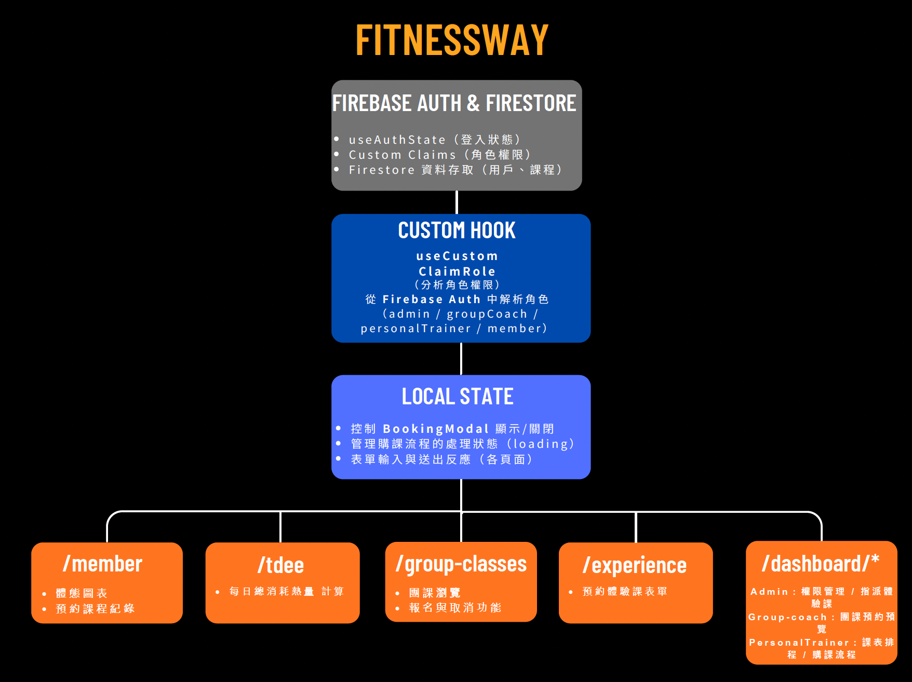

---

## 🧪 技術亮點

### ✅ Firebase Role-based Access Control

- 使用 **Custom Claims** 管理四種角色：
  - `admin` / `groupCoach` / `personalTrainer` / `member`

- 精細化設計 **Firestore Rules**
  - 僅允許特定角色存取、查詢、修改特定資料

### ✅ Component-based 設計

- 所有頁面皆使用自定義元件拆分
- 使用 custom hooks 做權限邏輯封裝

### ✅ RWD 響應式設計

- Tailwind CSS 建構桌機 / 手機兩用版面
- Mobile Menu, Responsive Card, Flex Grid

### ✅ 模擬金流：TapPay

- 實作 TapPay 前端串接  
- 完整模擬購買課程流程、建立訂單、紀錄堂數

---

### 🧪 Demo 帳號

- 管理員：admin@msn.com / admin123
- 團課教練：test001@gmail.com / 123456
- 私人教練：test002@gmail.com / 12345678

---
## 🚀 安裝與啟動

```bash
git clone https://github.com/yourname/fitnessway.git
cd fitnessway
npm install

# 建立 .env.local，填入 Firebase 設定
npm run dev
```
## 🔐 Firebase 設定須知

- 開啟 Firebase Authentication
- 設定 Firestore Rules（已提供於 `firestore.rules`）
- 使用 Admin SDK 設定 Custom Claims（可參考 `lib/firebase-admin.ts`）

---


## 📎 專案連結

[https://fitnessway.vercel.app/](https://fitnessway.vercel.app/)

---

## 👨‍💻 作者

陳昱仲  
E-mail:volcano1107@gmail.com
